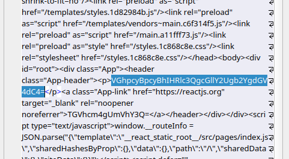
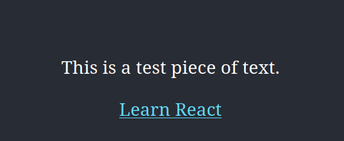

# Garlic 🧄🧛

Garlic is a simple, fast and secure way to protect your website from being scraped by bots.


---

You write your code and text as you would any other day, just let garlic protect your content from scraping.

| POV | Result|
|----|---|  
| You Write    | `<p>This is a test piece of text</p>` |
| Scraper Sees |            |
| User Sees    |              |

# How?
Currently, this is in development, but the beta works like this:

## React
You just need to wrap your html in the `garlic()` method:

```reactjs
function App() {
  return garlic(
          <div className="App">
            <p>Go away robots :)</p>
          </div>
  );
};
```

## Astro
Coming soon :)

## Want some salt with that?
We can also add some [salt](https://auth0.com/blog/adding-salt-to-hashing-a-better-way-to-store-passwords/) to the encoding, add that extra step of security.

# Why?
AI needs data, your website might end-up in the dataset it uses for training. Dont want that? Garlic should help :)
